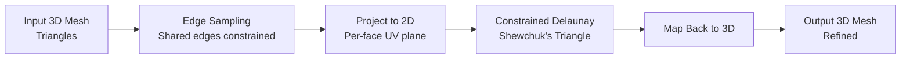

# SurfRemesh

<p align="center">
  <a href="https://github.com/csv610/SurfRemesh/releases">
    
  </a>
  <a href="https://github.com/csv610/SurfRemesh/blob/master/LICENSE">
    
  </a>
  <a href="https://github.com/csv610/SurfRemesh/issues">
    
  </a>
  <a href="https://cmake.org/">
    
  </a>
</p>

SurfRemesh is a C++20 library and command-line tool for refining triangular surface meshes using a planar Delaunay triangulation approach. It projects each triangular face to 2D, applies Delaunay refinement using Jonathan Shewchuk's Triangle algorithm, and maps the refined result back to 3D.

## Algorithm

The refinement works in two stages:

### Stage 1: Edge Refinement
1. Sample each edge based on max edge length
2. Shared edges (border between two faces) are constrained - both faces share the same edge nodes

### Stage 2: Face Triangulation
1. Project each triangular face onto its own 2D plane using local coordinate system
2. Apply constrained Delaunay triangulation using Shewchuk's Triangle
3. Map refined 2D triangles back to 3D coordinates



**Embarrassingly Parallel**: Each edge and face can be processed independently:
- Edge sampling: No dependencies between edges
- Face triangulation: Faces share boundary nodes but refinement is independent
- Perfect for parallel processing on multi-core GPUs/CPUs

**Constrained Delaunay**: Shared edges are marked as constraints so both adjacent faces use consistent node sampling

## Features

- **Edge Constrained Refinement**: Shared edges between faces use consistent sampling
- **Constrained Delaunay**: Uses Shewchuk's Triangle with segment constraints
- **Embarrassingly Parallel**: All edges and faces can be processed independently
- **Scalable**: O(n) with near-linear speedup on multi-core CPUs/GPUs
- **Multi-Format Support**: Load meshes in various formats (OFF, OBJ, STL, PLY, FBX, glTF, GLB, 3DS, DAE)
- **Edge Analysis**: Analyze edge length distribution with histogram visualization
- **Best for Coarse Meshes**: Quick uniform refinement of coarse triangular meshes
- **Modern C++**: Built with C++20 and standard libraries

## Installation

### Prerequisites

- CMake 3.16+
- C++20 compatible compiler (GCC 10+, Clang 14+, MSVC 2019+)
- [ASSIMP](https://github.com/assimp/assimp) (fetched automatically)

### Build

```bash
# Clone the repository
git clone https://github.com/csv610/SurfRemesh.git
cd SurfRemesh

# Create build directory
mkdir build && cd build

# Configure with CMake
cmake .. -DCMAKE_BUILD_TYPE=Release

# Build
cmake --build . -j$(nproc)
```

## Usage

### Mesh Refinement

```bash
./surfremesh <input.mesh> <max_edge_length> <output.mesh>
```

**Example:**
```bash
./surfremesh models/bunny.obj 0.5 models/bunny_remeshed.obj
```

### Edge Statistics

```bash
./edge_stats <input.mesh> [num_bins]
```

**Example:**
```bash
./edge_stats models/bunny.obj 20
```

**Output:**
```
Edge length statistics:
  Min:    0.0234567
  Mean:   0.0345678
  Max:    0.0567890

Edge length distribution (20 bins):
  [  0.0235,   0.0252):   1234 (25.6789%)
  [  0.0252,   0.0269):    890 (18.4321%)
  ...
```

## Supported Formats

| Format | Extension | Read | Write |
|--------|-----------|------|--------|
| Wavefront OBJ | .obj | Yes | Yes |
| Object File Format | .off | Yes | Yes |
| Stanford PLY | .ply | Yes | No |
| STereo Lithography | .stl | Yes | No |
| Filmbox FBX | .fbx | Yes | No |
| glTF | .gltf, .glb | Yes | No |
| 3D Studio | .3ds | Yes | No |
| COLLADA | .dae | Yes | No |

## API Usage

```cpp
#include "SurfRemesh.h"

int main() {
    SurfRemesh remesh;
    remesh.setMesh("input.obj");
    remesh.setMaxEdgeLength(0.5);
    remesh.refine();
    remesh.saveAs("output.obj");

    // Get edge statistics
    auto lengths = remesh.getEdgeLengths();
    std::cout << "Min: " << lengths[0] << "\n";
    std::cout << "Mean: " << lengths[1] << "\n";
    std::cout << "Max: " << lengths[2] << "\n";

    return 0;
}
```

## Project Structure

```
SurfRemesh/
├── app/
│   ├── main.cpp          # Main application entry
│   └── edge_stats.cpp   # Edge statistics tool
├── src/
│   ├── SurfRemesh.h    # Library header
│   ├── SurfRemesh.cpp  # Library implementation
│   ├── veclib.hpp    # Vector mathematics
│   ├── trilib.hpp    # Triangle geometry
│   ├── triangle.c    # Delaunay triangulation
│   └── triangle.h    # Triangle header
├── CMakeLists.txt    # Build configuration
└── README.md
```

## Dependencies

- [ASSIMP](https://github.com/assimp/assimp) - 3D mesh import library
- [Triangle](https://www.cs.cmu.edu/~quake/triangle.html) - Delaunay triangulation (bundled)

## License

SurfRemesh is distributed under the MIT License. See [LICENSE](LICENSE) for details.

Triangle is copyrighted by Jonathan Richard Shewchuk and distributed under its own license.

## Acknowledgments

- [Jonathan Shewchuk](https://www.cs.berkeley.edu/~jrs/) for the Triangle library
- [ASSIMP](https://github.com/assimp/assimp) team for mesh I/O support

## Contributing

Contributions are welcome! Please read our [contributing guidelines](CONTRIBUTING.md) before submitting PRs.

## Related Papers

If you use this software in academic work, please cite the original Delaunay triangulation papers:

> Shewchuk, J. R. (2002). Delaunay Refinement Algorithms for Triangular Mesh Generation. *Computational Geometry: Theory and Applications*, 22(1-3), 21-74.

> Shewchuk, J. R. (1997). Adaptive Precision Floating-Point Arithmetic and Fast Robust Geometric Predicates. *Discrete & Computational Geometry*, 18(3), 305-363.

> Ruppert, J. (1995). A Delaunay Refinement Algorithm for Quality 2-Dimensional Mesh Generation. *Journal of Algorithms*, 18(3), 548-585.

## When to Use This Algorithm

**Suitable for:**
- **Coarse mesh refinement**: Initial mesh has very large triangles that need uniform subdivision
- **Quick prototyping**: Fast refinement without complex setup
- **Preprocessing**: Generate denser mesh before applying smoothing/fairing algorithms
- **Isotropic refinement**: When uniform triangle sizes are needed across the surface

**Not suitable for:**
- **Quality improvement**: For remeshing to improve triangle quality (aspect ratio)
- **Anisotropic meshing**: When directional refinement is needed
- **Topology changes**: When boundary modification is required

**Alternative tools for quality remeshing:**
- [Geogram](https://github.com/BrunoLevy/geogram) - Advanced remeshing
- [Polygon Mesh Processing](https://github.com/pmelberg/pmp) - Quality mesh processing
- [CGAL](https://www.cgal.org/) - Computational geometry library

Use this tool when you have a coarse mesh and need quick uniform refinement. Use Geogram/ PMP/CGAL when you need high-quality optimized meshes or non-uniform refinement strategies.